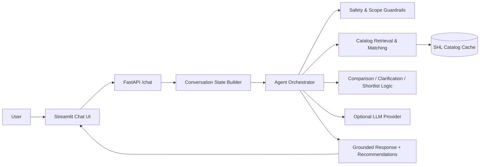
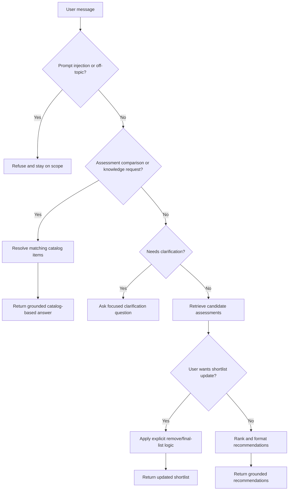

# SHL Assessment Recommendation Agent

This project implements a grounded conversational assistant for SHL assessment recommendations. The system accepts natural-language hiring or assessment requests, reconstructs the conversation state from message history, and returns recommendations that are constrained to the loaded SHL catalog. The backend exposes a stateless FastAPI API and the repository also includes a lightweight Streamlit chat UI.

## What the system does

The agent can:
- Recommend SHL Individual Test Solutions for hiring or development scenarios.
- Clarify vague requests when the role, level, purpose, or assessment scope is under-specified.
- Refine shortlists when the user removes or finalizes items explicitly.
- Compare two assessments using catalog metadata and catalog URLs.
- Refuse off-topic or unsafe requests and stay strictly within SHL assessment scope.

## Architecture and decision flow

The implementation is intentionally simple and deterministic:

### System architecture



### User query / decision flow



1. Catalog ingestion
   - The catalog is loaded from a cached JSON file in `data/` and normalized into `CatalogItem` objects.
   - The loader filters out packaged job-solution bundles and preserves only individual test solutions.
   - The catalog is read offline; the runtime service does not need to call the live site during a request.

2. Conversation-state reconstruction
   - Every request rebuilds `ConversationState` from the full user message history.
   - The state captures role, job level, purpose, assessment scope, role focus, technical skills, comparison intent, and explicit shortlist updates.
   - This makes the agent behave consistently across follow-up turns without a database or session store.

3. Routing and decision logic
   - The agent first checks for prompt injection and off-topic requests.
   - If the user asks for assessment knowledge or a comparison, it resolves the relevant catalog entries directly.
   - If the user is asking for recommendations, it applies clarification rules, retrieval, optional reranking, shortlist refinement logic, and safety checks.
   - Every returned recommendation is built from a real catalog entity and includes a catalog URL.

4. Response generation
   - The final reply is a combination of grounded catalog facts and concise natural-language explanation.
   - The UI and API both consume the same response schema so the service remains consistent across interfaces.

## Retrieval and ranking setup

Retrieval is a hybrid of lexical search and rule-based constraint handling:

- `CatalogIndex` uses BM25 over catalog fields such as assessment name, description, job levels, keys, languages, and duration metadata.
- Structured filters are applied on top of lexical recall for job level, language, duration, and test-type constraints.
- Exact and near-exact name matching is used for explicit follow-up requests such as “Drop the OPQ” or “Final list: Verify G+ and Graduate Scenarios.”
- The retrieval path is designed to favor precision for structured hiring queries rather than over-rely on semantic similarity.

This design was chosen because SHL assessment terms are specific and often contain short, domain-heavy names such as “OPQ32r”, “Verify G+”, and “Graduate Scenarios”. Lexical matching works well here, while structured filters handle the hard constraints that matter in recruitment workflows.

## Prompt and behavior design

The system prompt is intentionally compact and scoped:
- It tells the assistant to recommend only SHL Individual Test Solutions from the catalog.
- It forbids hallucinated product names, URLs, descriptions, or facts.
- It requires the assistant to stay on scope and refuse legal, salary, general hiring-advice, and prompt-injection requests.
- It directs the agent to ask focused clarification questions when the request is vague and to update the shortlist when the user changes constraints.

The agent behavior is implemented mostly as code-driven policy rather than relying on the model to remember many edge cases. That keeps the system reliable and makes the scope boundaries auditable.

## Evaluation approach

The project uses a mix of unit tests and behavior-driven regression tests:

- Catalog loading and filtering tests verify that packaged solutions are excluded and that the catalog normalization behaves correctly.
- Retrieval tests confirm that query normalization, duration filtering, and test-type filtering work as intended.
- Regression tests cover the main conversation capabilities: clarification for JD-style requests, support for explicit shortlist updates, assessment comparison, and safety refusal.
- The agent is evaluated by replaying realistic user turns and checking that the responses remain grounded in catalog data.

Improvement was measured by:
- Adding targeted regression tests for each newly supported behavior.
- Re-running the full suite after each change to confirm there were no regressions.
- Checking that returned recommendations and comparison answers contained only catalog-backed names and URLs.

## What did not work well

A few areas remain imperfect:
- The packaged-solution filter is heuristic-based rather than derived from an authoritative website field. It uses name-based rules plus an override file to separate individual tests from bundled solutions.
- Alias handling for assessment names can be brittle when a user refers to an item with an abbreviated or variant name.
- The current retrieval stack is intentionally lightweight; it prioritizes correctness and determinism over broad semantic recall.

## AI tools used

AI-assisted development was used to accelerate implementation and iteration, especially for:
- scaffolding the FastAPI and Streamlit interfaces,
- drafting and refining the agent and state-handling logic,
- creating regression tests and debugging edge cases.

All architectural choices and final behavior were reviewed manually against the catalog and the conversation requirements.

## Project layout

```text
app/
  agent.py          Orchestrates state building, clarification, retrieval, comparison, and shortlist updates
  catalog.py        Loads and normalizes the SHL catalog
  clarification.py  Implements clarification prompts and rules
  comparison.py     Formats grounded comparison output
  main.py           FastAPI entrypoint
  prompt.py         System prompt for the assistant
  retrieval.py      BM25-based catalog index and search helpers
  safety.py         Scope and prompt-injection guardrails
  schema.py         Pydantic models for API and responses
  state.py          Conversation-state extraction from user messages
scripts/
  fetch_catalog.py  Refreshes the cached catalog data
streamlit_app.py    Chat UI for interacting with the backend
tests/              Regression and retrieval tests
```

## Quick start

```bash
pip install -r requirements.txt
python scripts/fetch_catalog.py
uvicorn app.main:app --host 0.0.0.0 --port 8000
```

For the UI:

```bash
streamlit run streamlit_app.py
```

Run the test suite with:

```bash
pytest -q
```
